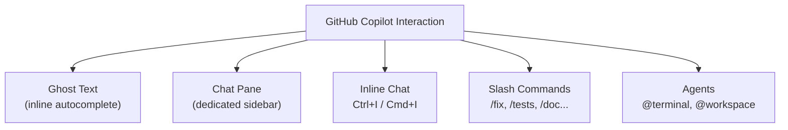

# Exam Prep Summary: Advanced GitHub Copilot Features

This summary covers the advanced, interactive features of GitHub Copilot and how to apply them to an existing project — chatting, inline chat, slash commands, agents, selective context, and the practical Web API workflow (add a route, write a test, generate docs).

---

## Learning Objectives

By the end of this module, you should be able to:

- **Work with a preconfigured GitHub repository in Codespaces** that has the GitHub Copilot extension installed.
- **Use interactive features** of GitHub Copilot to generate useful suggestions for an existing project.
- **Apply advanced features** to learn about a new project, write documentation, and create unit tests.

**Main objective:** Use interactive prompts and other advanced Copilot features to enhance a software project.

---

## 1. Core Concepts

| Concept | Key Fact |
| :--- | :--- |
| **Ghost text** | The greyed-out inline suggestions Copilot provides. Accept with **`Tab`**; ignore by continuing to type. |
| **Default context** | Copilot uses the **files you have open** in the editor as additional context — no explicit prompt required. |
| **GitHub Codespaces** | A **cloud-hosted** dev environment that runs with VS Code. Preinstalls dependencies, libraries, extensions, and settings. |
| **Prompting methods** | You can prompt via a **code comment**, the **chat window**, or the **inline chat**. |

> **Free tier limits (exam trivia):** ~**2,000** code autocompletes and **50** chat messages per month. Codespaces gives all accounts **60 free hours/month** with two-core instances.

---

## 2. Ways to Interact with Copilot



### A. Chat Pane
- Opened via the **chat icon in the left sidebar**; appears in a dedicated pane.
- Ask questions about current code or general software questions.

### B. Inline Chat
- **Shortcut:** `Ctrl + I` (Windows) / `Cmd + I` (Mac).
- **Benefit:** No context switching — suggestions happen **right next to your code**.

---

## 3. Slash Commands (High-Yield for Exam)

Slash commands give Copilot a **specific intent**, producing better answers **without long prompts**. They work in **both** the inline chat **and** the chat pane. Type `/` to see the drop-down list.

| Command | Purpose |
| :--- | :--- |
| `/fix` | Proposes a fix for a bug in the selected code. |
| `/doc` | Adds comments/documentation to the specified or selected code. |
| `/explain` | Explains what the selected code does. |
| `/generate` | Generates code to answer the specified question. |
| `/help` | Gets help on how to use Copilot chat. |
| `/optimize` | Analyzes and improves the runtime performance of selected code. |
| `/tests` | Creates unit tests for the selected code. |

---

## 4. Agents

**Agents** let you scope a chat to a specific context.

- **`@terminal`** — Chat with Copilot about the terminal, e.g., fixing errors or finding commands based on terminal output.
  - Example: `@terminal How do I fix the error message I'm seeing?`
- Agents are useful when you want Copilot to reason from a **specific surface** rather than just open files.

---

## 5. Selective Context

Copilot can tailor suggestions to a chosen context (whole **workspace**, **terminal output**, etc.) without opening many files.

- **Example — generate a Dockerfile:**
  > `I need to create a Dockerfile for this project, can you generate one that will help me package it?`
- **Refine by being more specific:**
  > `Help me create a Dockerfile to package this project but make sure you are using a Virtual Environment for Python.`
- If a suggestion isn't right, **reword the prompt** or **start writing code** for Copilot to autocomplete.

---

## 6. Implicit Prompts

You don't always need a detailed prompt — some features supply a **pre-crafted prompt** for you.

**Example workflow:** Select buggy code → press `Ctrl+I` / `Cmd+I` → type `/fix`.

```python
with open("file.txt", "r") as file:
    # Read the file and print the content
    contents = file.read   # Bug: missing () to call the method
```
Copilot responds by suggesting the parentheses (`file.read()`) and fixing the method call.

---

## 7. Practical Workflow: Extending a Web API

The exercise uses a Python (FastAPI-style) **Travel Weather API**. An **API** is the intermediary that lets different applications communicate.

### Step 1 — Add a new route (Inline Chat)
Open `main.py`, press `Ctrl+I` / `Cmd+I`, prompt:
> `Create a new route that exposes the cities of a country/region.`

```python
# Create a new route that exposes the cities of a country:
@app.get('/countries/{country}')
def cities(country: str):
    return list(data[country].keys())
```
> Route allows only **GET** requests and returns a **JSON** response.

### Step 2 — Create a test (`/tests`)
Select the code, then use inline chat or the chat pane:
> `/tests help me to create a new test for this route that uses Spain as the country/region.`

Refine with natural language if the test is wrong:
> `This test is not quite right, it is not including cities that doesn't exist. Only Seville is part of the API.`

### Step 3 — Document with Agent mode
Open `README.md` and use **Copilot Chat Agent mode**:
> `I want to document how to run this project so that other developers can get started quickly by reading the README.md file.`

---

## 8. Key Exam Takeaways

- **Ghost text** = inline suggestions; **`Tab`** accepts them.
- Copilot uses **open files** as default context.
- **Inline chat** = `Ctrl+I` / `Cmd+I`; keeps you in the code.
- **Slash commands** work in both inline chat and the chat pane and reduce the need for long prompts.
- Remember the command → purpose mapping: `/fix`, `/doc`, `/explain`, `/generate`, `/help`, `/optimize`, `/tests`.
- **`@terminal`** agent = terminal-aware help (errors, commands).
- **Selective context** lets Copilot answer using the whole workspace or terminal without opening many files.
- **Codespaces** = cloud VS Code dev environment, preconfigured with the Copilot extension.
- Typical advanced workflow: **add a route → generate tests → document with Agent mode**.
