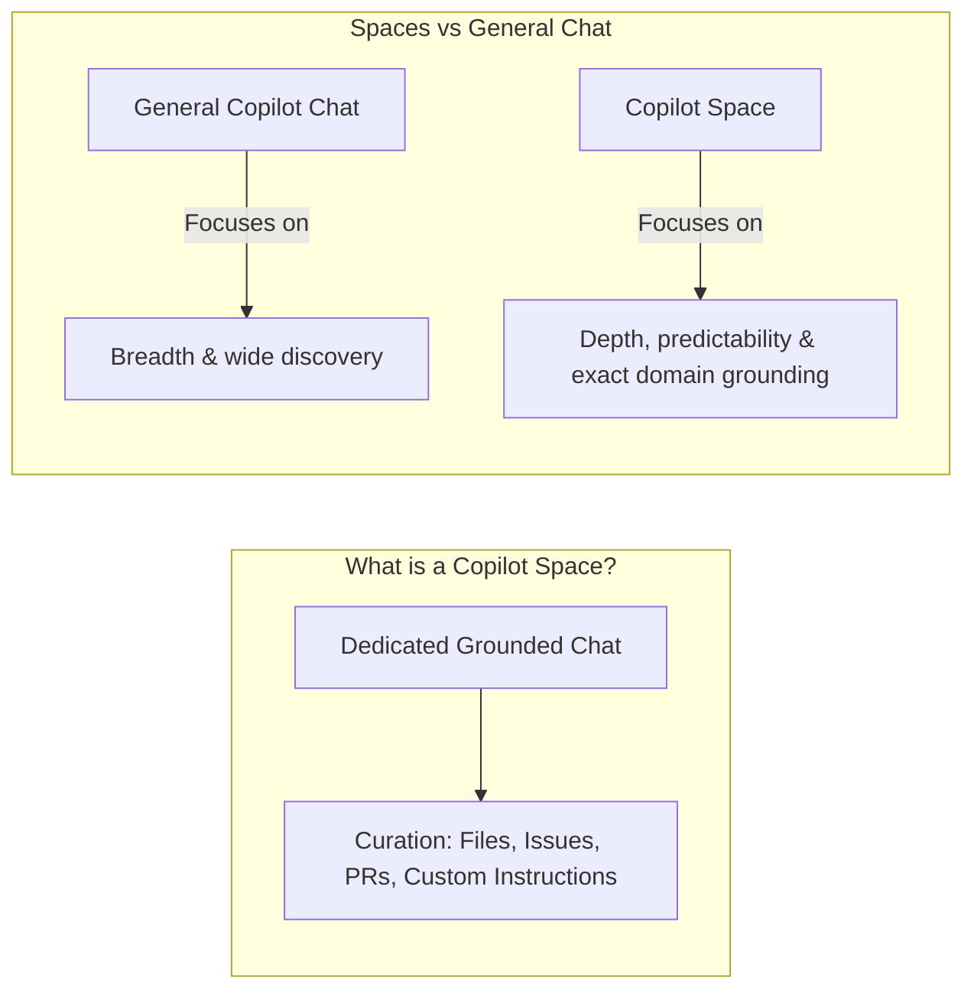
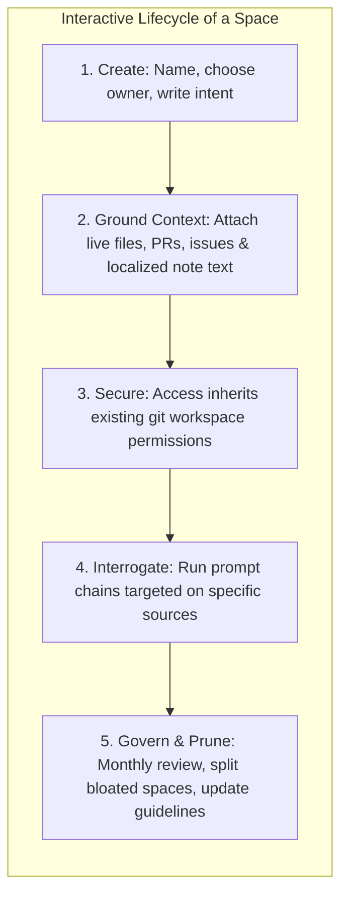

# Exam Prep Summary: GitHub Copilot Spaces

An overview covering the architecture, configuration, governance, and operating do's/don'ts of GitHub Copilot Spaces.

---

## Learning Objectives

By the end of this module, you should be able to:

- **Differentiate** between Spaces and general Copilot Chat (breadth vs. depth).
- **Create, configure, and customize** Spaces using attached files, issues, PRs, and custom instructions.
- **Govern and maintain** Spaces under model context limits and secure repository permissions.

---

## 1. What is a GitHub Copilot Space?

A **GitHub Copilot Space** is a dedicated Copilot chat session grounded heavily in a curated context of your choice.

### Key Differences

- **General Chat**: Trades depth for breadth. Broad discovery across the repository but might offer less precise suggestions.
- **Copilot Space**: Trades breadth for depth. Delivers consistent, highly predictable, and grounded responses aligned with your target context.

---

## 2. Setting Context: Input Selection & Setup

The reliability of a Copilot Space correlates directly to the selectivity and logical arrangement of the context you attach.

### Context Inputs Supported

- **Free-text Instructions**: Describe Copilot's area of expertise, exact workflows, style preferences, output formatting constraints, and what it should avoid. Keep instructions brief and actionable.
- **Repository Attachments**: Select code files, folders, issues, or pull requests from your GitHub repository.
- **Custom Local Uploads**: Direct uploads of images, transcripts, spreadsheets, or localized text notes from your workstation.

> 💡 **Tip**: Order matters. Put the highly critical files or instructions at the absolute top of your attachments to drive more accurate and contextual suggestions.

---

## 3. Creating & Populating your First Space

1. **Access**: Navigate to [github.com/copilot/spaces](https://github.com/copilot/spaces) and select **Create space**.
2. **Identification**: Declare a purpose-driven name (helps discoverability) and optional description.
3. **Ownership**: Select **Personal** or **Organization** ownership. Org-owned spaces inherit GitHub’s visual permission models for seamless sharing.
4. **Context Provision**:
   - **Attach Files/Folders**: Pulls real-time code and documentation from the main branch.
   - **Link PRs / Issues**: Paste full Markdown reference links.
   - **Upload Local Assets**: Import spreadsheet (.xlsx, .csv), image (.png), or custom text files.
   - **Custom Notes**: Input typed/pasted raw text directly into the space configuration canvas.

---

## 4. Visibility, Permissions & Governance

To maintain long-term utility across workflows, lightweight yet active boundaries must be configured.

- **Sharing**: Set appropriate visibility. Org-owned Spaces can be searched or cataloged across teams using specific prefixes (e.g., `"ServiceName-Onboarding"`).
- **Security & Access Boundaries**:
  - Spaces **do not bypass** traditional security. A viewer must already have permission to access private repositories/PRs/issues referenced by the Space to see them represented in suggestions.
  - Avoid entering credentials or sensitive API keys inside free-text notes; leverage version-controlled private repositories where standard review pipelines apply.
- **Versioning & Freshness**: Linked repository documents are live-checked against the **default/main branch** of their parent repositories, eliminating out-of-sync configuration drifts.
- **Governance**: Keep spaces modular—**"One job per Space."** When a Space blooms beyond a single dedicated role or service, split it into smaller, distinct Spaces to maintain accuracy and context window limits.

---

## 5. Working in a Space: Do's and Don'ts

| Do's | Don'ts |
| :--- | :--- |
| **Do** keep your questions tightly scoped and bounded only to the sources attached. | **Don't** @-mention individuals or unrelated Copilot extensions inside a Space (it won't execute them or trigger notifications). |
| **Do** draft prompt patterns that generate runnable, verifiable, compile-ready code or scripts. | **Don't** expect the Space to search or fetch repository documentation that wasn't explicitly linked. |
| **Do** iterate actively: refine/tighten instructions or add 1–3 clear golden examples to anchor output formatting. | **Don't** let a Space sprawl. If you hit prompt window size warnings or notice degraded suggestions, split the resources. |
| **Do** leverage chronological sorting: place the most important files or style rules at the top of your configurations. | **Don't** copy-paste or write credentials and raw PII data into the untracked note canvases. |
