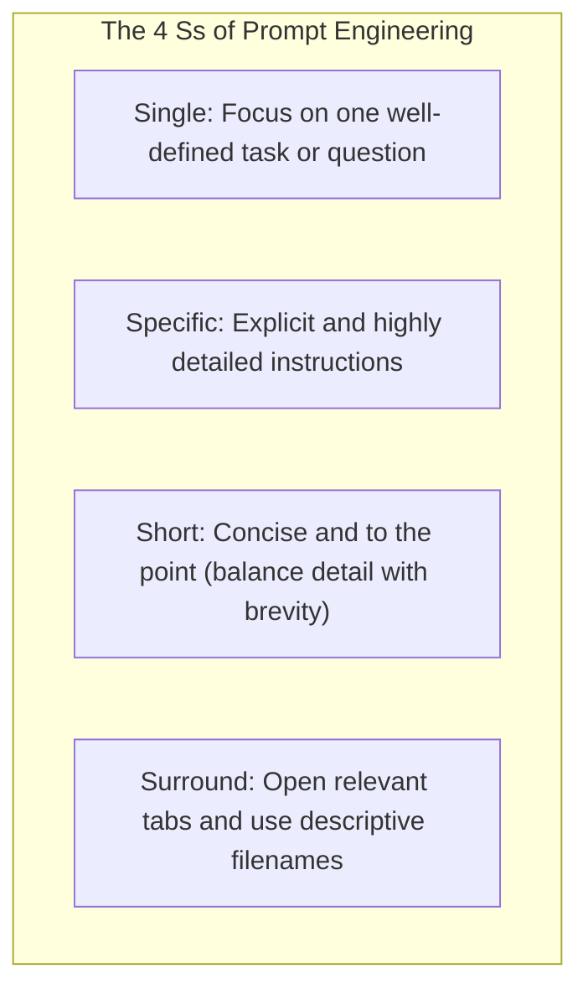
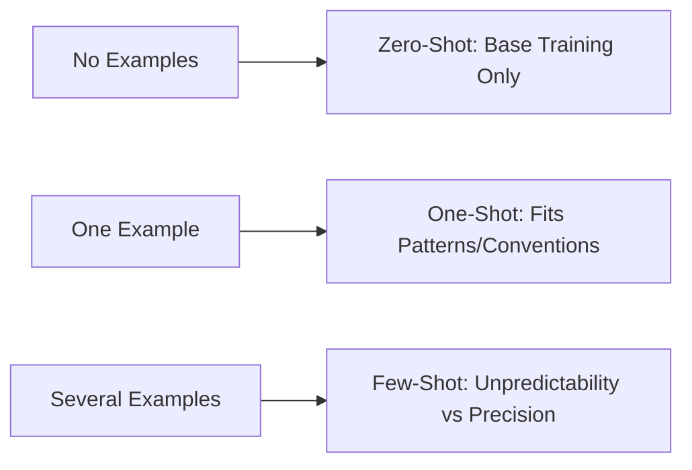
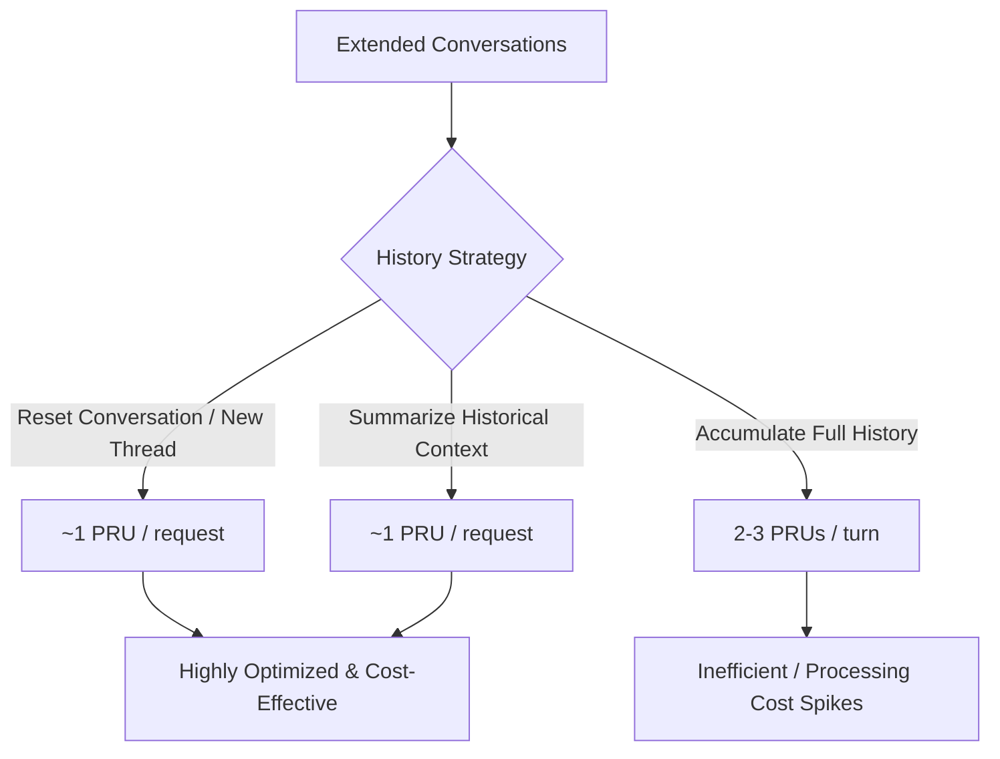
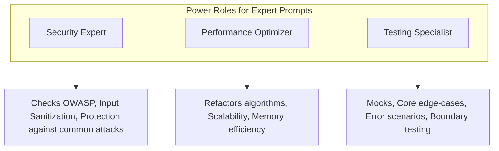
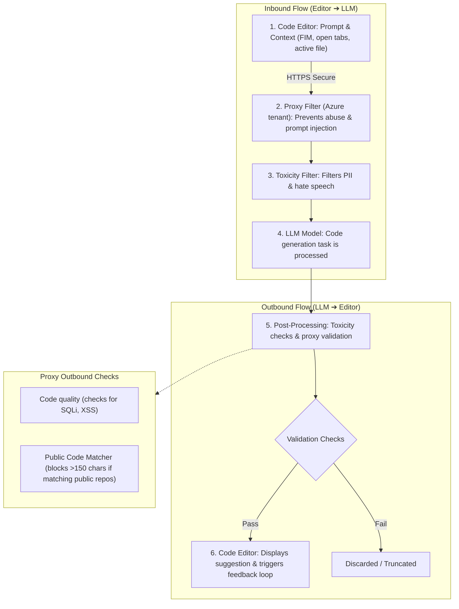
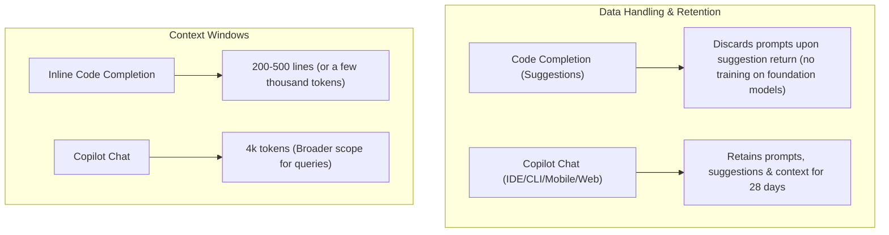
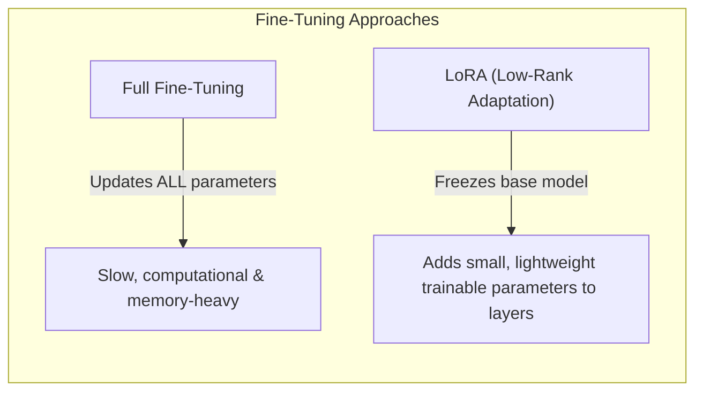

# Exam Prep Summary: GitHub Copilot Prompt Engineering

This summary covers foundational prompt engineering principles, learning approaches, chain prompting, and role prompting optimized for GitHub Copilot.

---

## Learning Objectives

By the end of this module, you should be able to:

- **Craft effective prompts** that optimize GitHub Copilot's performance, ensuring precision and relevance while accelerating development.
- **Understand prompt-response dynamics** and utilize advanced strategies such as Role Prompting and Chat History Management.
- **Optimize resource usage** based on how Copilot processes prompts under-the-hood (from secure transmission to content filtering).

---

## 1. Core Principles: The **4 Ss**

The foundational rules for creating effective prompts with GitHub Copilot:

- **Single**: Do not overwhelm Copilot with multiple distinct tasks in one query.
- **Specific**: Clear instructions yield code that is syntactically, functionally, and contextually correct.
- **Short**: Keep prompt sizes balanced to avoid complexity.
- **Surround**: Keep sibling/related files open in parallel tabs in the editor. Copilot analyzes adjacent open tabs for extra context.

---

## 2. Prompt Engineering Best Practices

Maximize performance and quality by applying these techniques:

- **Provide Enough Clarity**: Translate abstract requests into concrete descriptions (e.g., "Write a Python function to filter and return even numbers from a given list").
- **Provide Context with Details**: Add step-by-step developer comments at the top or inside the code block to outline execution flow.
- **Provide Examples**: Clarify requirements by showing sample inputs/outputs. Great for generating boilerplate code, test templates, and repetitive patterns.
- **Assert and Iterate**: Do not restart from scratch if the output isn't perfect. Treat it as a dialogue: delete the unsatisfactory code, update your prompt comments with more examples/instructions, and trigger suggestion again.

---

## 3. How Copilot Learns (Shining the Light on Shot Learning)

Copilot uses several learning paradigms depending on how much prompt-level training you provide in-context:

| Learning Type | Detail | Ideal For | Example Prompt / Scenario |
| :--- | :--- | :--- | :--- |
| **Zero-Shot** | Relies entirely on Copilot's foundational model training. | Rapidly implementing common/standard patterns. | `// Create temperature converter between C and F` |
| **One-Shot** | Input 1 reference example to instruct style/conventions. | Consistency across codebase and custom patterns. | Providing 1 existing converter function first, then asking Copilot to write another. |
| **Few-Shot** | Inputs several examples to balance unpredictability and precision. | Sophisticated implementations handling edge cases. | Greeting code examples mapped to hours of the day. |

---

## 4. Chain Prompting & Chat History Management

When executing complex workflows in GitHub Copilot Chat, managing history is crucial for resource and pricing efficiency.

- **What is a PRU?**: Prompt/Processing Resource Unit (or PRU count).
- **Resource Hit**: Carrying full conversation history over 5+ turns consumes **2-3 PRUs** per turn.
- **Efficiency Practices**:
  1. **Summarize context**: *"Based on our previous authentication conversation, now implement rate limiting."*
  2. **Reset the environment**: Start in a fresh chat window for a new, unrelated task to clear token overhead.
  3. **Use concise references**: Refer to already written modules clearly instead of copy-pasting code blocks in chat.

---

## 5. Role Prompting for Specialized Tasks

Instructing Copilot to adopt a specific expert persona drastically improves initial precision and reduces revision cycles in specialized domains.

- **Security Expert Persona**:
  - *Prompt*: *"Act as a cybersecurity expert. Create a password validation function following OWASP guidelines."*
  - *Result*: Secure, robust sanitization, defensive guards against input vulnerabilities.
- **Performance Optimization Persona**:
  - *Prompt*: *"Act as a performance optimization expert. Refactor this sorting algorithm to handle large datasets efficiently."*
  - *Result*: Scalable data structures, optimized resource utilization, faster runtimes.
- **Testing Specialist Persona**:
  - *Prompt*: *"Act as a testing specialist. Create comprehensive unit tests including edge cases."*
  - *Result*: Thorough coverage, mocks, boundary tests, and failure cases.

---

## 6. GitHub Copilot User Prompt Process Flow (Inbound & Outbound)

To generate precise suggestions, Copilot transmits, validates, and processes prompts using a secure, bi-directional loop.

### Inbound Flow Summary

1. **Secure Prompt Transmission & Context Gathering**:
   - Transmits prompts securely over **HTTPS**.
   - Gathers: Code before/after cursor, active filename/type, adjacent open tabs, and project structure/frameworks.
   - Applies **Fill-in-the-Middle (FIM)** pre-processing to analyze code surrounding the cursor.
2. **Proxy Filter**:
   - Routed through a proxy in a GitHub-owned Microsoft Azure tenant.
   - Blocks prompt injection, jailbreaking, and reverse-engineering of prompt mechanisms.
3. **Toxicity Filtering (Input Check)**:
   - Safeguards against hate speech and offensive content.
   - Actively filters out **Personal Identifiable Information (PII)** like names, addresses, and ID numbers.
4. **Code Generation**:
   - LLM receives the filtered, context-enriched payload and generates context-aware suggestions.

### Outbound Flow Summary

1. **Post-Processing & Validation**:
   - Outbound response is checked by the **Toxicity Filter** to strip harmful generated content.
   - The **Proxy Server** executes quality & safety validation checks:
     - **Code Quality**: Detects vulnerabilities (e.g., Cross-Site Scripting (XSS), SQL Injection).
     - **Matching Public Code**: Checks suggestions over **~150 characters** against public GitHub repositories. If matching, it is blocked (if configured).
2. **Suggestion Delivery & Feedback Loop**:
   - Deliverable suggestions appear in the editor.
   - Copilot tracks actions (accept, reject, or modify) to refine model accuracy over time via a local/telemetry feedback loop.
3. **Iterate**:
   - The loop repeats on subsequent typing or chat inputs.

---

## 7. GitHub Copilot Data Handling & Context Windows

How data is collected, formatted, retained, and constrained across environments.

### Data Handling Comparison

- **Code Suggestions (Completion)**:
  - **Zero Retention**: Discards prompts immediately after returning suggestions. Never uses prompts to train the foundational model.
  - **Opt-out**: Copilot Individual subscribers can opt-out of prompt sharing for fine-tuning.
- **Copilot Chat (Conversational)**:
  - **Formatting**: Auto-formats response (e.g., syntax highlight) and offers options for direct code integration.
  - **User Engagement**: Maintains chat history in the current pane to retain conversational context.
  - **Retention Limits**: Prompts, suggestions, and context inside/outside the IDE (CLI, Mobile, Web) are typically retained for **28 days**.

### Prompt Types Supported by Copilot Chat

1. **Direct Questions**: Coding concepts, library capabilities, or debugging (e.g., *"How do I implement quick sort in Python?"*).
2. **Code-Related Requests**: Generation, refactoring, documentation, or explanation (e.g., *"Explain this code block."*).
3. **Open-Ended Queries**: Broad style advice or architectural guidelines (e.g., *"What are the clean code best practices here?"*).
4. **Contextual Prompts**: Requesting improvements on a specific section of code (e.g., *"How can I secure this authentication section?"*).

### Context Window Limits and Strategies

- **Inline Code Completion Window**: Typically **200–500 lines of code** (or a few thousand tokens).
- **Copilot Chat Window**: Features an expanded **4k tokens** window for managing larger prompts and questions.
- **Optimization Strategy**: To avoid exceeding the limit, break down complex requirements into smaller, modular queries, or feed ONLY relevant code snippets to the assistant.

---

## 8. GitHub Copilot & Large Language Models (LLMs)

GitHub Copilot utilizes LLMs as its core cognitive engine, customized and optimized specifically for software engineering tasks.

### What is an LLM?

Large Language Models (LLMs) are deep artificial intelligence networks designed to understand, construct, and predict natural human language and code.

- **Vast Training Volumes**: Trained on billions of lines of public code and diverse written texts.
- **Deep Parameterization**: Built with millions to billions of parameters, optimized to predict subsequent text fragments (tokens).
- **Extremely Versatile**: Not bound to a single programming language or natural writing style.

### The Role of LLMs in Copilot & Prompting

- **Context-Aware Synthesis**: The LLM evaluates active file segments alongside open tabs to provide optimal completions.
- **Prompt as a Query**: The quality of the LLM's output directly correlates with the specificity, clarity, and context provided in the prompt.

### Fine-Tuning LLMs

Fine-tuning adapts a generic pre-trained **source model** to excel at niche target operations by training on a specialized **target dataset**.

#### LoRA Fine-Tuning (Low-Rank Adaptation)

- **Frozen Original Model**: The massive pre-trained model parameters remain unchanged.
- **Trainable Rank Decomposition Matrices**: Small adapter parameters are inserted into the network layers to accommodate specific code tasks.
- **Key Benefits**:
  - **Resource Efficiency**: Saves processing time and GPU memory.
  - **Performance**: Exceeds older methods like direct prefix-tuning or deep adapters while keeping training costs highly manageable.
